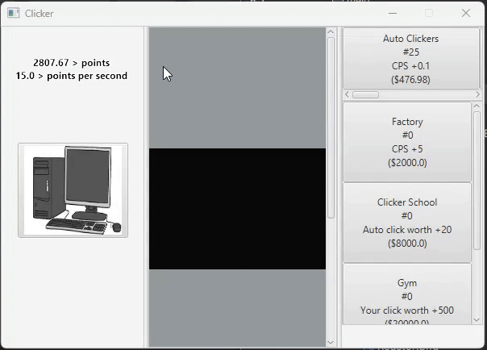
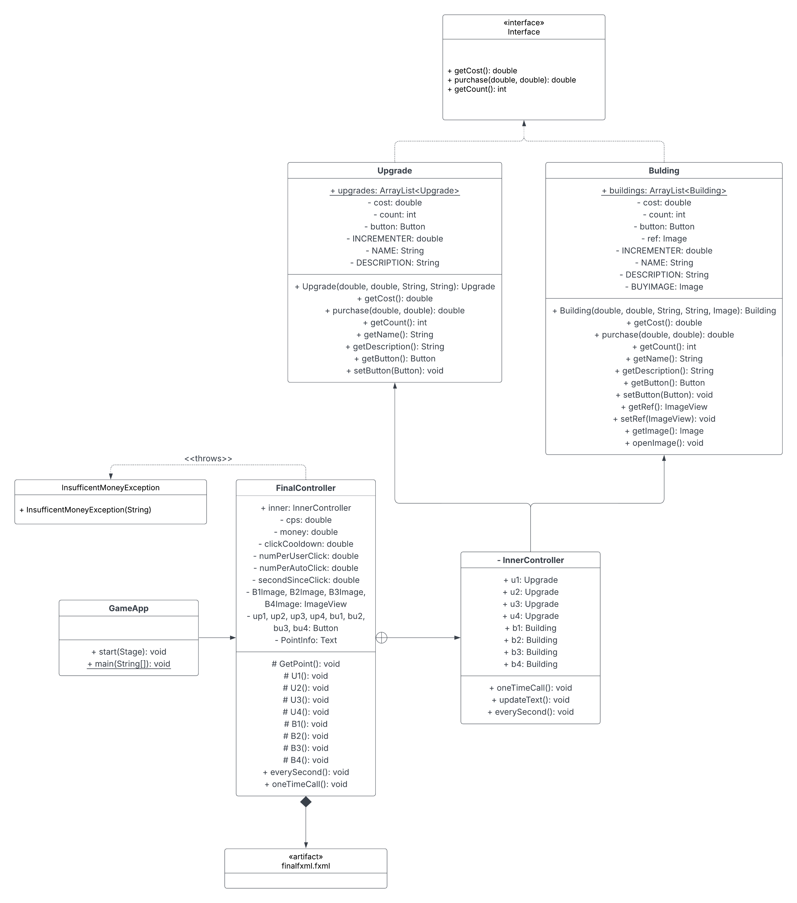

# Unit Deliverable 3 - Final Project

# backrowteam presents, Computer clicker! By Scott Pickslay, Eduardo Martin, Alexander Anderson

## Description

Our project was inspired by hit web game, cookie clicker. With the same general format we took heavy inspiration from the game but with our own computer science spin. You can click the computer to take out your frustration after your code stops working, earn points to click the computer faster, and buy even more upgrades to satisfy your computer clicking desires.

Cookie clicker: [link](https://orteil.dashnet.org/cookieclicker/)

## Demo

## UML Diagram

## Wireframe

